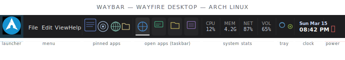

### Installation Instructions
### Preview



Boot into the Arch Linux Live USB, connect to the internet, and run the following commands:

```bash
# 1. Download the repository
git clone [https://github.com/greysonofusa/Arch-Gaming.git](https://github.com/greysonofusa/Arch-Gaming.git)

# 2. Navigate to the directory and make the scripts executable
cd Arch-Gaming
chmod +x install.sh chroot.sh

# 3. Run the Automated Installer
./install.sh
