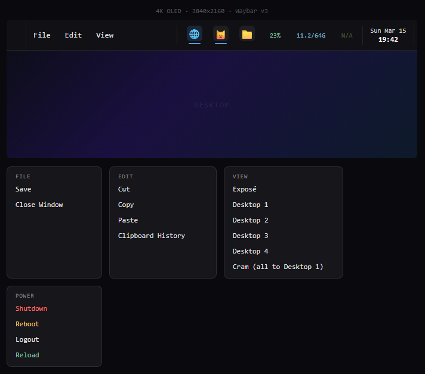

### Preview
Version 4 Waybar


# Installation Instructions: Complete System Install AM4/5 CPU & RTX GPU Only 
### Arch + Mango WC (waybar, wofi, wtype) + CachyOS Kernel + AM5 Tweaks With Open RGB scripts and Liquidctl scripts for AIO Coolers: 
**Disclaimer: If you don't have an AM5 CPU and a NVIDIA RTX GPU this probably won't work for you!**
Before you install: Download the <a href="https://www.example.com](https://archlinux.org/download/">Arch Linux Live ISO</a>, make it bootable with a USB drive, connect to the internet, and run the following commands:
```bash
# 1. Download the repository
git clone https://github.com/greysonofusa/Arch-Gaming.git

# 2. Navigate to the directory and make the scripts executable
cd Arch-Gaming
chmod +x install.sh chroot.sh

# 3. Run the Automated Installer
./install.sh
```
# Installation Instructions Arch/ Debian based post install: waybar/wofi/wtype:
Make sure you install dependencies:
### Arch: 
```bash
pacman -S waybar wofi wtype
```
### Debian/Ubuntu:
```bash
apt install waybar wofi wtype
```
Download the waybar .jsonc and .css file to ~/Downloads folder:
 
 ```bash
cp ~/Downloads/config.jsonc ~/.config/waybar/config.jsonc
cp ~/Downloads/style.css ~/.config/waybar/style.css
mkdir -p ~/.config/waybar/scripts
cp ~/Downloads/file-menu.sh ~/.config/waybar/scripts/
cp ~/Downloads/edit-menu.sh ~/.config/waybar/scripts/
cp ~/Downloads/view-menu.sh ~/.config/waybar/scripts/
cp ~/Downloads/power-menu.sh ~/.config/waybar/scripts/
cp ~/Downloads/app-right-click.sh ~/.config/waybar/scripts/
chmod +x ~/.config/waybar/scripts/*.sh
pkill waybar; sleep 1 && waybar -c ~/.config/waybar/config.jsonc -s ~/.config/waybar/style.css &
```

### Special Thanks To
Splash Art Gradient 8k Desktop Wallpaper Graphic Design by gradienta
DreamMaoMao - Lead Developer of Mango WC
Alexis Rouillard - Alexays developer of Waybar
SimplyCEO developer of Wofi
